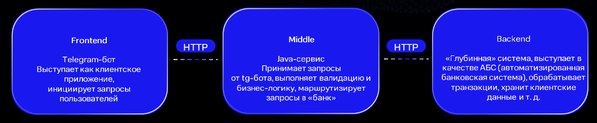
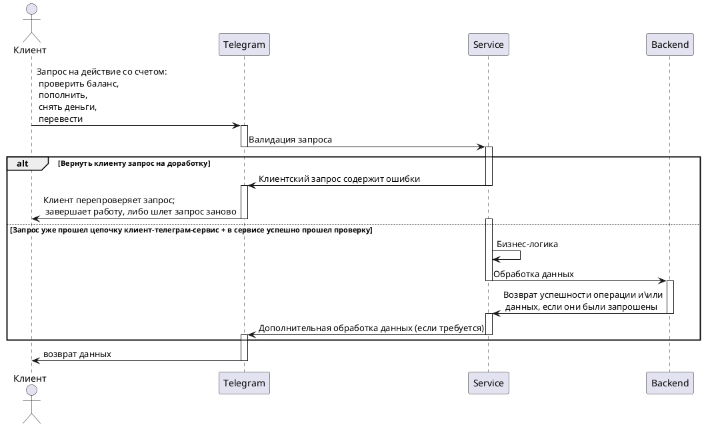

<h1 align="center"> khasmamedov-middle-service </h1>

### Это - вторая часть, а именно сервис, или прослойка (движок), написанная на java, выполняет бизнес-логику и выступает связующим звеном между фронтом и бэкендом


### Базовое верхнеуровневое представление:

<br/><br/>

### Про проект в-общем и фронт-часть:
[ссылка на гитхаб](https://github.com/gpb-it-factory/khasmamedov-telergam-bot/blob/trunk/README.md)  

  <br/><br/>
  <b><a href="https://gpb.fut.ru/itfactory/backend?utm_source=gpb&utm_medium=expert&utm_campaign=recommend&utm_content=all">GBP IT-factory</a></b> | <b><a href="">Документация(_пока пуста_)</a></b> | <b><a href="">Демо(_пока пуста_)</a></b> | <b><a href="https://github.com/gpb-it-factory/khasmamedov-middle-service">GitHub (middle)</a></b> <br>  
  <b><a href="#За_что_отвечает_middle-service">За_что_отвечает_middle-service</a></b> <br>
  <br/><br/>
  <a target="_blank" href="https://github.com/gpb-it-factory/khasmamedov-telergam-bot"></a>
  <br/><br/>

### Весь проект на диаграмме ниже: 


### Как_запустить_и_начать_работу _ // здесь пока способы запуски без докер компоуза, как отдельные модули

<details>
  <summary>Подготовка программ/окружения</summary>

Для локальной установки приложения вам понадобятся [Git](https://git-scm.com/), [Java 21](https://axiomjdk.ru/pages/downloads/), [Gradle](https://gradle.org/), [IDEA](https://www.jetbrains.com/idea/download/)
</details>

<details>
  <summary>Получение токена</summary>

Вам нужен токен (действует как пароль), если его еще нет:    
см. [документацию](https://core.telegram.org/bots/tutorial#obtain-your-bot-token)

</details>

Способы запуска приложения - standAlone (1 и 2) и основной - как докер-приложение (3)

<details>
  <summary>Получение проекта</summary>

* Скачать проект с репозитория выше целиком [перейдя по ссылке на гитхаб](https://github.com/gpb-it-factory/khasmamedov-middle-service)    
  ````code -> download zip````    
  Распаковать архив, добавить в среду разработки как новый проект
* Либо, склонировать его      
  ````git@github.com:gpb-it-factory/khasmamedov-middle-service.git````  
  <span title="_в обоих случаях среда разработки сама подтянет gradle и зависимости_">примечание про зависимости</span>

</details>

<details>
  <summary>Запуск проекта</summary>

* Собрать проект в готовый к исполнению файл   
  ````gradle build````  (если есть установленный грэдл)
    + ИЛИ же ````gradlew build````  (если Windows и грэдла нет)
    + ИЛИ же ````chmod +x gradlew```` ````./gradlew build```` (если Linux и грэдла нет)
* Запустить его:  
  ````java -jar ./build/libs/khasmamedov-middle-service-0.0.1-SNAPSHOT.jar````  
  <span title="_, где после команды -jar идет путь (полный или относительный) до сборки; обычно это build/libs/_">примечание про пути</span>
* ИЛИ же - запуск проекта "под ключ":  
  ````.\gradlew.bat bootRun```` (Windows)  
  ````./gradlew.bat bootRun```` (Linux)  
  <span title="_ctrl+c, чтобы выйти из приложения в общем виде_  
  в последнем случае (Б), на вопрос:  
  ````Завершить выполнение пакетного файла [Y(да)/N(нет)]?```` -> y  ">как выйти из приложения</span>

</details>

<details>
  <summary>Запуск проекта через докер</summary>

* Если у вас еще нет докера, нужно его скачать:  
  [ссылка на докер](https://docs.docker.com/get-docker/)
* Создать в докере image (посмотреть docker -> images в системе)  
  `docker build -t middle-service .`
* Запустить приложение:
  + В фоновом режиме:  
    `docker run --name middle-service -d middle-service`  
    _чтобы выйти в этом случае - набрать в терминале: `docker stop telegram-bot`_
  + С отображением результатов работы программы, включая логи и возможные ошибки:
    `docker run --name middle-service -it middle-service`  
    <span title="_ctrl+c, чтобы выйти из приложения в данном случае_">выход из приложения</span>
    <span title="_Если вы видите ошибку типа `docker: Error response from daemon: Conflict. The container name "/имя контейнера" is already in use by container "длинное имя". You have to remove (or rename) that container to be able to reuse that name.`,  
    вам потребуется остановить это контейнер перед тем как запускать программу:  
    `docker stop 23a960d080bd5798917cb70c5a33992c3ae2a715a9cd0187822cab80f632973e`
    `docker rm 23a960d080bd5798917cb70c5a33992c3ae2a715a9cd0187822cab80f632973e`_">примечание про ошибки контейнеров</span>

</details>

### За_что_отвечает_middle-service
На настоящий момент дорабатывается.  
